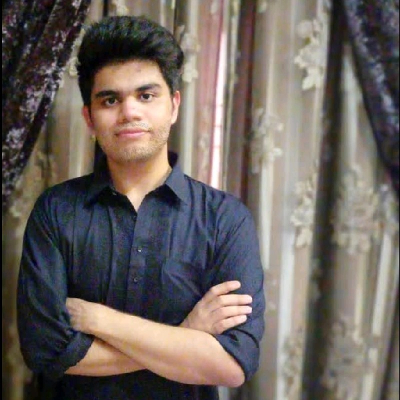

> You don’t become confident by shouting affirmations in the mirror, but by having a stack of undeniable proof that you are who you say you are. Outwork your self doubt. - Alex Hormozi

### Navigate to
* [👋 About Me](#👋-about-me)
* [📊 Research Interests](#📊-research-interests)
* [📄 Publications](#📄-publications)
* [🏫 Teaching](#🏫-teaching)
* [👨‍🏫 References](#👨‍🏫-references)
* [📝 Blogs](#📝-blogs)
* [🤷‍♂️ Miscellaneous](#🤷‍♂️-miscellaneous)

##  👋 About Me

I am a rising Computer Science senior at the <a href="https://www.lums.edu.pk/" target="_blank">Lahore University of Management Sciences (LUMS)</a>, Pakistan. Broadly, I am interested in diving deeper into networked and distributed systems, but I’m willing to entertain any compelling projects. Currently, my research primarily centers on the following theme: rethinking the internet design and architecture to account for better affordability, inclusion, and user experience. I'm currently working under the supervision of <a href="https://web.lums.edu.pk/~zafar" target="_blank">Dr. Zafar Ayyub Qazi</a>
 and <a href="https://www.ihsanqazi.com" target="_blank">Dr. Ihsan Ayyub Qazi</a>.

Over my junior year, I've worked on a Measurement Analysis study quantifying the buffer losses incurred due to in-stream YouTube advertisements. We've quantified how users in developing and developed countries bear the incurred financial burden due to these ads. I have experience in submitting to leading conferences like the ACM Web Conference (formerly, WWW) 2023 and the ACM CoNEXT 2023. To read about this work, head to my research statement [here](research-statement.pdf "download").

##  📊 Research Interests

Currently, my research calls for immediate steps towards reconsidering the design of various
applications on the internet to make them affordable, inclusive and offer a better user experience. Broadly, I’m motivated to entertain projects that circle programmable networks, cellular networks, cloud computing, high-performance computing, performance analysis, and verification of different networks. An intersection of computational algorithms, packet forwarding and measurement functions, and congestion control mehanisms within data centers also draws my attention.

##  📄 Publications

> Coming Soon...

##  🏫 Teaching

* Undergraduate Teaching Assistant, LUMS
    * CS200/EE201: Introduction to Programming (Spring 2023)

##  👨‍🏫 References

* Dr. Zafar Ayyub Qazi: Assistant Professor, Department of Computer Science, LUMS
* Dr. Ihsan Ayyub Qazi: Associate Professor, Department of Computer Science, LUMS

##  📝 Blogs

* <a href="https://harris-ahmad.notion.site/harris-ahmad/a504b98dedee42ac9ea256d92ff2668c?v=2fd15646449048aabca5b40bbd8d2384" target="_blank">A Comprehensive Guide on Object Oriented Constructs in C++</a>

<!-- add a relevant emoji and the heading "Miscellaneous" -->
##  🤷‍♂️ Miscellaneous

* One of the papers I've enjoyed reading is [Raft](https://raft.github.io/raft.pdf).
* I'm a huge fan of the [C++](https://isocpp.org/) programming language.
* The song I'm currently listening to is [Hero](https://www.youtube.com/watch?v=mYFaghHyMKc) by Family of the Year.
* When I find some time to spare, I like to scroll through [@rmdrk](https://www.instagram.com/rmdrk/?hl=en)'s and [@blakeaudenpoetry](https://www.instagram.com/blakeaudenpoetry/?hl=en)'s Instagram. Their quotes are worth reading. 